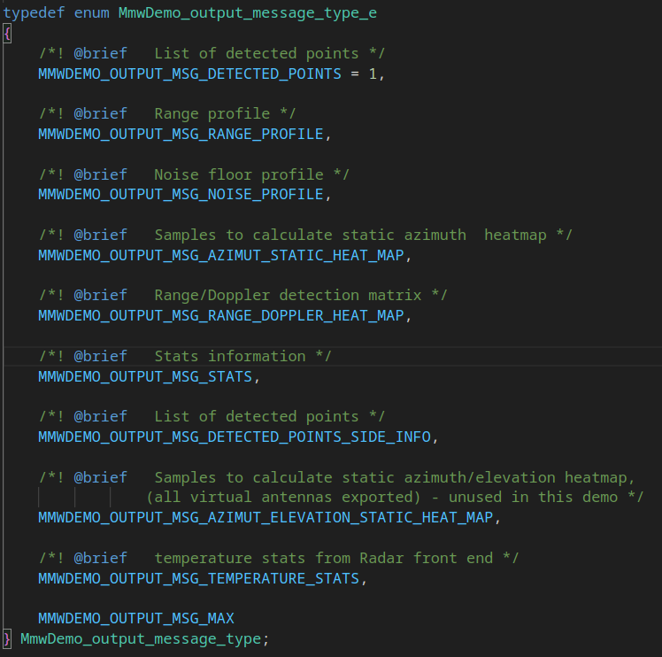

# This repository contains code that interfaces with mmWave AWR1642

## Project overview
# TODO Change README 

The ```cfg.py``` program is reponsible to send config and commands to radar. Config might be obtained using TI Demo Visualizer

The ```data.py``` program reads data from Serial Port -> it receives 2D Point Cloud data from mmWave device whem it is flashed with TI demo from SDK

## Installation
It is recomended to use conda environment. The environment can be optained from   ```environment.yml``` file using:    
```
$ conda <environment_name> create -f environment.yml
```

# Data stream
TLV frames types



[//]: # (## Run)

[//]: # (First run the ```cfg.py``` file in order to send config and start the device. Then fire up the ```data.py``` to see the data from radar)

[//]: # ()
[//]: # (## Config)

[//]: # (The config send to the device depends on the version of SDK flashed to mmWave radar. Paste .cfg file to the cfgs folder and specify the name of the config using option:   )

[//]: # (```)

[//]: # ($ python3 cfg.py --cfg AWR1642-SDK<SDK_version>)

[//]: # (```    )

[//]: # (The defalt cfg is for SDK 3.2.0, it will be chosen when not specifying certain config. Similarly the cfg port might be specifed by:)

[//]: # (```)

[//]: # ($ python3 cfg.py --port /dev/ttyACM0)

[//]: # (```)

[//]: # (Config can also be send using TI mmWave Demo Visualizer)

[//]: # ()
[//]: # (## Reading data)

[//]: # (To read the data specify data port on your system:)

[//]: # (```)

[//]: # ($ python3 data.py --port /dev/ttyACM1)

[//]: # (```)